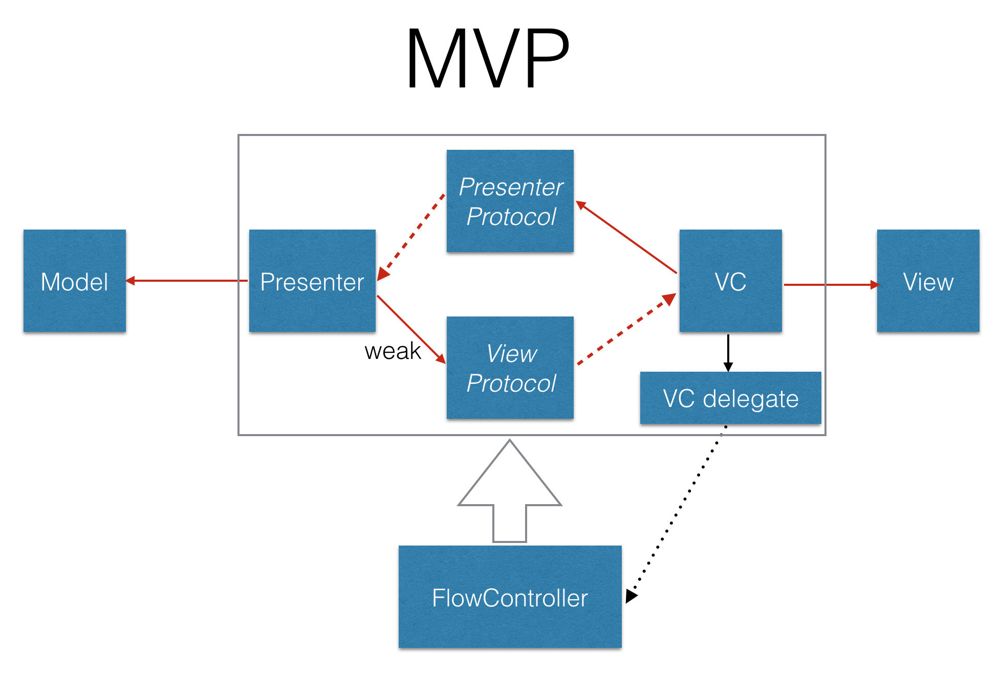

# MVP-FlowControllers-Swift

🚧🚧🚧🚧🚧🚧🚧🚧🚧🚧🚧🚧🚧🚧🚧🚧🚧🚧🚧🚧🚧

After read [@merowing_](https://twitter.com/merowing_) post about FlowControllers and [this](https://github.com/digoreis/ExampleMVVMFlow) example about FlowControllers and MVVM, I decided to create a simple example using MVP and FlowControllers.

The main idea is to create an open project so that everyone can give his point of view on this architecture, because at this moment I have not found any good example.

🚧🚧🚧🚧🚧🚧🚧🚧🚧🚧🚧🚧🚧🚧🚧🚧🚧🚧🚧🚧🚧



## FlowControllers

### FlowController.swift

Direct inspired by @digoreis example, in this file there are defined the `FlowController` and the `FlowConfigure`.
The first one is the interface of any FlowControllers. The second is the configuration necessary to configure a new child FlowController.

```swift
import UIKit

enum FlowType {
    case main
    case navigation
}

struct FlowConfigure {
    let window: UIWindow?
    let navigationController: UINavigationController?
    let parent: FlowController?

    func whichFlowAmI() -> FlowType? {
        if window != nil { return .main }
        if navigationController != nil { return .navigation }
        return nil
    }
}

protocol FlowController {
    init(configure: FlowConfigure)
    func start()
}
```

### FlowInizializer.swift

The `FlowInizializer` is called in the `AppDelegate` and it has the scope to instantiate the first FlowController.

```swift
struct FlowInizializer {
    func configure(_ window: UIWindow?) {
        let configure = FlowConfigure(window: window, navigationController: nil, parent: nil)
        let mainFlow = MainFlowController(configure: configure)
        mainFlow.start()
    }
}
```

### MainFlowController.swift

This is the first FlowController instantiated in your project. It doesn't create any `ViewController` and `Presenter` couple, but just a FlowController child.

```swift
class MainFlowController: FlowController {
    let configure: FlowConfigure
    var childFlow: FlowController?

    required init(configure: FlowConfigure) {
        self.configure = configure
    }

    func start() {
        let navigationController = UINavigationController()
        if let frame = configure.window?.bounds {
            navigationController.view.frame = frame
        }

        configure.window?.rootViewController = navigationController
        configure.window?.makeKeyAndVisible()

        let dashConf = FlowConfigure(window: nil, navigationController: navigationController, parent: self)
        childFlow = DashboardFlowController(configure: dashConf)
        childFlow?.start()
    }
}
```

### DashboardFlowController.swift

This is an FlowController example. It controls the flow of two (the only two 😅) viewcontroller in the project, `DashboardViewController` and `SecondViewController`.
In the functions `configureFirst()` and `configureSecond()` the FlowController instantiates the viewcontrollers and their presenters and pushes them in the `navigationController`.

```swift
enum DashboardFlowState: Int {
    case main
    case detail
}

class DashboardFlowController: FlowController {
    fileprivate let configure: FlowConfigure
    fileprivate var state: DashboardFlowState

    required init(configure: FlowConfigure) {
        self.configure = configure
        self.state = .main
    }

    func start() {
        switch self.state {
        case .main:
            guard let viewController = configureFirst() else { return }

            configure.navigationController?.pushViewController(viewController, animated: true)
        case .detail:
            guard let viewController = configureSecond() else { return }

            configure.navigationController?.pushViewController(viewController, animated: true)
        }
    }

    fileprivate func configureFirst() -> UIViewController? {
        guard let viewController = R.storyboard.main.firstViewController() else { return nil }

        viewController.presenter = DashboardPresenterImplementation(view: viewController)
        viewController.configure = ConfigureDashboardViewController(delegate: self)
        return viewController
    }

    fileprivate func configureSecond() -> UIViewController? {
        guard let viewController = R.storyboard.main.secondViewController() else { return nil }

        viewController.presenter = SecondPresenterImplementation(view: viewController)
        viewController.configure = ConfigureSecondViewController(delegate: self)
        return viewController
    }

    fileprivate func goNext() {
        switch state {
        case .main:
            self.state = .detail
        case .detail:
            return
        }
    }

    fileprivate func goPrevious() {
        switch state {
        case .main:
            return
        case .detail:
            self.state = .main
        }
    }
}

extension DashboardFlowController: ConfigureDashboardViewControllerDelegate {
    func showNextViewController() {
        goNext()

        start()
    }
}

extension DashboardFlowController: ConfigureSecondViewControllerDelegate {
    func backToFirstViewController() {
        goPrevious()
    }
}
```

`ConfigureDashboardViewControllerDelegate` and `ConfigureSecondViewControllerDelegate` are the delegates used by the viewcontrollers to communicate with the FlowController.

## Presenters
Each presenters control only one viewcontroller. This control happens by an interface/protocol so you can test your presenter passing its a Mocked object conforms to this protocol.

### DashboardPresenter.swift

```swift
protocol DashboardView: class {
    func updateUI(withTitleLabel titleText: String, withDescriptionLabel descriptionText: String, andButton title: String)
}

protocol DashboardPresenter {
    func setupUI()
}

class DashboardPresenterImplementation: DashboardPresenter {
    fileprivate weak var view: DashboardView?

    init(view: DashboardView?) {
        self.view = view
    }

    // MARK: - DashboardPresenter
    func setupUI() {
        view?.updateUI(withTitleLabel: "a", withDescriptionLabel: "aa", andButton: "next")
    }
}
```

### SecondPresenter.swift

```swift
protocol SecondView: class {
    func updateUI(withDescriptionLabel descriptionText: String)
}

protocol SecondPresenter {
    func setupUI()
}

class SecondPresenterImplementation: SecondPresenter {
    fileprivate weak var view: SecondView?
    fileprivate let dataManager: DataManager

    init(view: SecondView?, dataManager: DataManager = DataManagerImplementation()) {
        self.view = view
        self.dataManager = dataManager
    }

    // MARK: - DashboardPresenter
    func setupUI() {
        getObject()
    }

    private func getObject() {
        dataManager.getData { (result) in
            guard let result = result as? [String: String] else { return }
            guard let label = result["object"] else { return }

            self.view?.updateUI( withDescriptionLabel: label)
        }
    }
}

protocol DataManager {
    func gerData(completition:@escaping (Any?) -> Void)
}

struct DataManagerImplementation: DataManager {
    func gerData(completition: @escaping (Any?) -> Void) {
        completition(["object": "MVP Test"])
    }
}
```

## ViewControllers

Also the ViewControllers have an interface/protocol as connection with respective presenters and with the FlowController.

### DashboardViewController.swift

`ConfigureDashboardViewControllerDelegate` it's the protocol that `DashboardFlowController` implements to receive the request to show the next viewcontroller.

```swift
struct ConfigureDashboardViewController {
    weak var delegate: ConfigureDashboardViewControllerDelegate?
}

protocol ConfigureDashboardViewControllerDelegate: class {
    func showNextViewController()
}

class DashboardViewController: UIViewController, DashboardView {
    @IBOutlet weak var descriptionLabel: UILabel!
    @IBOutlet weak var nextButton: UIButton!

    var presenter: DashboardPresenter!
    var configure: ConfigureDashboardViewController!

    override func viewWillAppear(_ animated: Bool) {
        super.viewWillAppear(animated)

        presenter.setupUI()
    }

    @IBAction func nextButtonTapped(_ sender: Any) {
        configure.delegate?.showNextViewController()
    }

    // MARK: - DashboardView protocol
    func updateUI(withTitleLabel titleText: String,
                  withDescriptionLabel descriptionText: String,
                  andButton title: String) {
        DispatchQueue.main.async {
            self.title = titleText
            self.descriptionLabel.text = descriptionText
            self.nextButton.setTitle(title, for: .normal)
        }
    }
}

```

### SecondViewController.swift

```swift
struct ConfigureSecondViewController {
    weak var delegate: ConfigureSecondViewControllerDelegate?
}

protocol ConfigureSecondViewControllerDelegate: class {
    func backToFirstViewController()
}

class SecondViewController: UIViewController {
    @IBOutlet weak var label: UILabel!

    var presenter: SecondPresenter!
    var configure: ConfigureSecondViewController!

    override func viewWillAppear(_ animated: Bool) {
        super.viewWillAppear(animated)

        presenter.setupUI()
    }

    override func didMove(toParentViewController parent: UIViewController?) {
        super.didMove(toParentViewController: parent)

        if parent == self.navigationController?.parent {
            configure.delegate?.backToFirstViewController()
        }
    }
}

extension SecondViewController: SecondView {
    func updateUI(withDescriptionLabel descriptionText: String) {
        DispatchQueue.main.async {
            self.label.text = descriptionText
        }
    }
}

```
